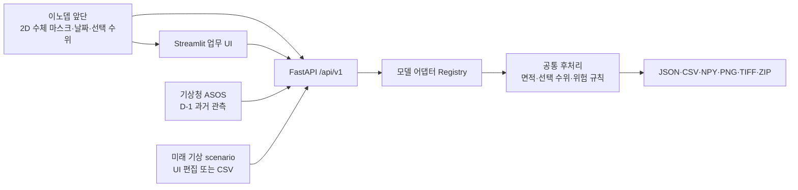

# WATERCAST · 수체 시계열 예측 과제용 애플리케이션

이 저장소의 실행 애플리케이션은 앞단 시스템이 만든 **수체 마스크 시계열**을 받아 미래
마스크·수체 면적·선택적 수위를 예측하고, 결과 전체를 REST API로 제공하는 구조입니다.
현재 저장소에는 검증된 학습 가중치가 없으므로 내장 모델은 정확도 모델이 아닌
`persistence`, `irregular-area-trend`, `weather-morphology` **연동 기준선**입니다. 실제 모델은 어댑터 하나를
등록해 UI나 API를 바꾸지 않고 교체할 수 있습니다.



## 바로 실행

Python 3.11 이상 환경에서 저장소 루트의 한 명령으로 백엔드와 UI를 함께 실행합니다.
첫 실행에만 `.venv`를 만들고 의존성을 설치합니다.

```bash
./run.sh
```

- 업무 UI: `http://localhost:8501`
- Swagger API 문서: `http://localhost:8000/docs`
- ReDoc: `http://localhost:8000/redoc`
- OpenAPI JSON: `http://localhost:8000/openapi.json`

첫 화면의 **빠른 테스트**에서 저장소 샘플을 고르고 **선택 샘플로 바로 예측**을 누르면
입력·기상·모델 단계를 한 번에 실제 FastAPI로 전송하고 결과 화면으로 이동합니다.

상단 **분석 업무 전환**에서 `🌾 작물 탐지`를 선택하면 수체 예측과 상태를 섞지 않는 별도
화면이 열립니다. 이 화면은 ESA의 실제 Sentinel-2A 공개 장면 또는 사용자 PNG/JPEG를 받아
식생·경작 후보의 원본, 점수 지도, 이진 마스크와 오버레이를 즉시 표시합니다. 현재 저장소에는
작물 학습 데이터·정답 라벨·가중치가 없으므로, 이 기능은 학습 모델이 아닌 **색상지수 기반
UI POC**입니다. 작물 종류·정확도·실제 면적은 산출하지 않으며 결과 화면과 JSON에도 그 한계를
명시합니다.

- 샘플 원천: [ESA · Desert fields](https://www.esa.int/ESA_Multimedia/Images/2015/07/Desert_fields)
- 크레디트: `Copernicus Sentinel data (2015)/ESA`
- 라이선스: [CC BY-SA 3.0 IGO](https://creativecommons.org/licenses/by-sa/3.0/igo/)
- 로컬 계보·사용 제한: [작물 샘플 자산 문서](ui_next/assets/crop/README.md)

| 샘플 | 분류 | 기본 모델 | 주의사항 |
|---|---|---|---|
| 부산 문서 그림 복원 | 문서 그림에서 복원한 4프레임 | `persistence` | 원본 래스터·지리참조·픽셀 면적이 없어 면적/수위 검증 금지 |
| 부산 NAS 광학 수체 라벨 | 실제 원본 4시점 공통격자 파생 | `irregular-area-trend` | 23·13·20일 불규칙 관측, 수위·미래 정답 없음 |
| ICEYE NAS SAR 수체 라벨 | 실제 원본 4쌍 공통격자 파생 | `irregular-area-trend` | 28·16·1일, 관측기하 차이, 수위·미래 정답 없음 |
| 낙동강 안정 예시 | 결정론적 합성 시나리오 | `weather-morphology` | 실제 낙동강 자료가 아닌 연동 확인용 예시 수위·기상 |
| 한강 가뭄 예시 | 결정론적 합성 시나리오 | `weather-morphology` | 실제 한강 가뭄·학습 모델 성능 자료가 아님 |
| 광주 홍수 예시 | 결정론적 합성 시나리오 | `weather-morphology` | 실제 광주 홍수·학습 모델 성능 자료가 아님 |

샘플 실행도 별도 데모 로직을 쓰지 않고 일반 multipart 예측 API와 같은 경로를 사용합니다.
광주·한강·낙동강이라는 시나리오 이름과 합성 변화 개념은 기존 `pipeline_ui` 발표 데모에도
있었지만, 현재 샘플 픽셀은 `ui_next/samples.py`가 새로 그린 192×192 마스크입니다. 사용자가
제공한 해당 지역 실측 파일을 읽은 것이 아니며 날짜·미래 강수·수위도 예시값입니다. 데이터
화면의 **설명 보기 · 이 샘플은 어디서 왔나요?**에서 항목별 계보를 확인할 수 있습니다.

실제 기상청 자료를 조회하려면 공공데이터포털에서 발급한 키를 설정한 뒤 실행합니다.

```bash
export KMA_API_KEY='발급받은 일반 인증키'
./run.sh
```

서버를 다시 시작하기 어렵다면 기상 화면의 비밀번호 입력 칸에 발급 키를 넣어 이번 요청에만
전달할 수도 있습니다. 키가 없을 때는 **샘플 시나리오 · 키 없이 즉시** 또는
**키 없이 같은 기간 샘플 조회**로 API/UI 연동을 계속 시험할 수 있습니다. 샘플은 화면과
응답에서 합성 자료로 표시되며 실관측이나 미래예보로 취급하지 않습니다.

## 화면 흐름

상단의 `💧 수체 시계열 예측`과 `🌾 작물 탐지`가 독립 업무 화면을 나눕니다. 아래 1~6은
수체 시계열 예측 흐름이며, 작물 탐지는 샘플/업로드 선택 → 영상 유형·임계값 설정 →
원본·오버레이·마스크 확인 → PNG/JSON 내보내기의 한 화면 흐름입니다.

1. 내장 샘플을 골라 즉시 테스트하거나, 동일 격자의 2D NPY/PNG/TIFF 수체 마스크를 시간순으로 올립니다.
2. 기상청 ASOS 과거 관측을 조회해 확인·편집하거나, 미래 기상은 `scenario` 행/CSV로 입력합니다.
3. 서버가 제공한 모델을 선택하고 목표 날짜 간격, 이진화 임계값, 픽셀 면적을 지정합니다.
4. 프레임별 면적·수위·위험도와 마스크를 보고 JSON/CSV/개별 파일/전체 ZIP을 받습니다.
5. **이해 가이드**에서 4컷 그림과 함께 1세부 전처리, 프레임·수체·수위, 제공 모델, 모델 교체, 모든 메뉴·버튼·입력값·차트와 발표 스크립트를 봅니다.
6. **API 가이드** 화면에서 실행 중인 OpenAPI 명세, 호출 예제, Swagger/ReDoc 링크와 흐름 그림을 봅니다.

데이터·기상·결과 화면에는 각각 동적 EDA가 있습니다. NAS 모드에서는 300개 파일을 8개
센서·제품 그룹으로 분리해 용량, 관측 타임라인, 준비도 행렬과 원본 픽셀/메타데이터 감사를
표시합니다. 부산·ICEYE 실제 라벨은 원본 공통영역 면적, 경량 마스크 오차, 단일 홀드아웃을
별도 표시하고 같은 자산을 즉시 API 예측에 보냅니다. 일반 입력에서는 관측 기간과 최소/중앙/최대 간격,
해상도와 수체 픽셀 변화, observed/scenario 구성과 강수·결측률, 예측 horizon·수위 산출률·
위험도 분포를 설명 문장과 함께 표시합니다. 픽셀 면적이 확인되지 않은 자료는 km² 대신
픽셀 수만 표시합니다.

UI는 `WATERCAST`라는 독자 명칭을 사용하며, 어두운 운영 대시보드·단계별 아이콘·짧은
물방울/예측파형 화면 전환·최근 실행 목록을 제공합니다.

상위 입력이나 모델 설정을 바꾸면 이전 조건으로 만든 기상/예측 결과가 자동으로 무효화되어
서로 다른 실행 결과가 섞이지 않습니다.

## 입력과 결과 계약

- UI 입력: 파일 하나당 2D 마스크와 날짜 하나. 파일들은 같은 높이·너비·격자여야 합니다.
- API 입력: 한 NPY의 `[T,H,W]` 시퀀스도 지원합니다. 날짜와 수위 배열은 디코딩된 T와 맞춥니다.
- 수위: 마스크 면적을 자동으로 수위라고 부르지 않습니다. 모델이 직접 출력하거나 사용자가
  현장에서 검증한 면적-수위 계수를 명시한 경우에만 `water_level_m`이 생깁니다.
- 위험도: 최신 입력 면적 대비 변화율로 계산한 규칙값이며 응답에 `rule_based: true`로 표시됩니다.
- GeoTIFF: 입력 격자의 CRS/transform이 모두 같으면 출력 TIFF에 전달합니다.

완료된 실행은 기본적으로 `backend/data/results/<prediction_id>/`에 저장됩니다. 서버 재시작 뒤에도
manifest를 다시 읽으며 다음 API로 전체 결과를 가져갈 수 있습니다.

| Method | Path | 설명 |
|---|---|---|
| `GET` | `/api/v1/models` | 내장 기준선과 외부 모델 목록 |
| `GET` | `/api/v1/weather/status` | ASOS 서버 키·요청별 키·샘플 지원 상태(키 값은 미노출) |
| `POST` | `/api/v1/weather/observations` | ASOS 과거 관측 또는 명시적 sample 조회 |
| `POST` | `/api/v1/predictions` | multipart 예측 실행 |
| `GET` | `/api/v1/predictions` | 저장된 예측 목록 |
| `GET` | `/api/v1/predictions/{id}` | 프레임별 전체 JSON 결과 |
| `GET` | `/api/v1/predictions/{id}/files` | JSON·CSV·마스크 파일 목록 |
| `GET` | `/api/v1/predictions/{id}/files/{name}` | 개별 산출물 |
| `GET` | `/api/v1/predictions/{id}/bundle` | 전체 결과 ZIP |

자세한 multipart 필드와 curl 예제는 [백엔드 문서](backend/README.md), 기상 필드와 출처는
[기상 연동 문서](weather_service/README.md), 화면 사용법은 [UI 문서](ui_next/README.md)에 있습니다.

## 실제 모델 교체

새 모델은 `PredictionAdapter`를 구현하고 환경변수로 등록합니다.

```bash
export PREDICTOR_PLUGINS='my_models.convlstm:ConvLSTMAdapter'
./run.sh
```

어댑터 입력은 `[T,H,W]` 마스크, 정규화된 기상 행, 날짜·horizon·옵션 context이고 출력은
`[horizon,H,W]` 마스크와 선택적 horizon 길이 수위 배열입니다. 등록된 모델 정보는
`GET /api/v1/models`에 나타나므로 UI 코드를 추가로 수정하지 않습니다. 최소 구현 예제는
[backend/README.md](backend/README.md#실제-모델-교체)에 있습니다.

U-Net처럼 원천영상 한 장을 0/1 마스크로 바꾸는 모델은 앞단 **수체 감지 모델**이고, 현재
`PredictionAdapter`는 과거 마스크 여러 장에서 미래 마스크를 만드는 **시계열 예측 모델**용입니다.
앞단을 이노뎁/1세부가 담당한다는 현재 범위에서는 탐지를 끝낸 마스크를 전달받습니다. 직접
업로드 화면의 **1세부 전달 규격 템플릿 ZIP**에는 `frames.csv`, 좌표·NoData·탐지 모델 계보를
적는 `metadata.json`, 초보자용 체크리스트가 들어 있습니다.

## 코드 구분

- `backend/`: 실제 실행 FastAPI, 모델 어댑터, 결과 저장/내보내기
- `weather_service/`: 기상청 ASOS 일 관측 클라이언트와 명시적 sample provider
- `ui_next/`: 백엔드만 호출하는 새 Streamlit 업무 UI
- `ui_next/crop_detection.py`: 작물/식생 후보 색상지수 기준선과 마스크·오버레이 생성
- `ui_next/crop_ui.py`: 수체 상태와 분리된 작물 탐지 결과 화면
- `1_water_body_detection/`, `2_time_series_prediction/`: 기존 연구/실험 코드
- `pipeline_ui/`: 기존 발표용 합성 데모. 실제 업무 흐름은 `ui_next/`를 사용합니다.

## 검증

```bash
python3 -m unittest discover -s weather_service/tests -v
python3 -m unittest discover -s ui_next/tests -v
pytest -q backend/tests
```

기상청 연동은 [공공데이터포털의 기상청 ASOS 일자료 공식 명세](https://www.data.go.kr/data/15059093/openapi.do)를
기준으로 하며, 이 자료는 D-1까지의 과거 관측이지 미래예보가 아닙니다.
