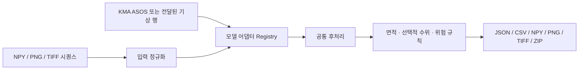

# 수체 시계열 예측 백엔드

앞단 수체 탐지 결과를 입력받아 **모델과 무관한 동일 API**로 미래 수체 마스크, 면적,
선택적 수위, 위험 규칙 결과를 내보내는 FastAPI 서비스입니다. 학습 모델이 준비되기 전에는
`persistence`, `irregular-area-trend`, `weather-morphology` 기준 모델로 전체 연동을 검증할 수 있고, 이후 어댑터만
추가하면 UI와 API 계약은 그대로 유지됩니다.



## 실행

저장소 루트에서 다음을 실행합니다.

```bash
python3 -m venv .venv-backend
.venv-backend/bin/pip install -r backend/requirements.txt
.venv-backend/bin/uvicorn backend.app.main:app --reload --port 8000
```

- Swagger UI: `http://localhost:8000/docs`
- ReDoc: `http://localhost:8000/redoc`
- OpenAPI JSON: `http://localhost:8000/openapi.json`
- 결과 저장 위치: 기본 `backend/data/results`, 변경 시 `BACKEND_RESULT_DIR`

## API

| Method | Path | 용도 |
|---|---|---|
| GET | `/api/v1/health` | 서비스·모델·저장소 상태 |
| GET | `/api/v1/models` | 교체 가능한 모델 목록과 옵션 |
| GET | `/api/v1/models/{model_id}` | 단일 모델 상세 |
| GET | `/api/v1/weather/status` | ASOS 서버 키·요청별 키·샘플 지원 상태(키 값은 미노출) |
| GET | `/api/v1/weather/stations` | UI용 주요 ASOS 지점 |
| POST | `/api/v1/weather/observations` | 실제 ASOS 또는 재현 가능한 sample 일자료 |
| POST | `/api/v1/predictions` | 파일 시퀀스 업로드 및 동기 예측 실행 |
| GET | `/api/v1/predictions` | 저장된 결과 목록 |
| GET | `/api/v1/predictions/{id}` | 프레임별 전체 JSON 결과 |
| GET | `/api/v1/predictions/{id}/files` | manifest·CSV·마스크 파일 목록 |
| GET | `/api/v1/predictions/{id}/files/{name}` | 개별 파일 조회 (`?download=true`로 첨부 다운로드) |
| GET | `/api/v1/predictions/{id}/bundle` | 결과 전체 ZIP 다운로드 |

### WBMS 실모델 (wbms:0.13 컨테이너)

인수받은 WBMS 실모델은 백엔드가 **호스트 러너 subprocess**로 `docker run --rm ... wbms:0.13`
을 실행해 구동합니다(docker.sock 미마운트 — 보안 결정). 테스트는 이 subprocess 경계를
mock 합니다.

| Method | Path | 용도 |
|---|---|---|
| GET | `/api/v1/wbms/status` | 이미지·번들·기상 CSV·캐시 준비 상태 |
| POST | `/api/v1/wbms/segmentation/jobs` | ② detect_water 비동기 잡 생성(CPU 씬당 약 610초) |
| GET | `/api/v1/wbms/segmentation/jobs` | 잡 목록 |
| GET | `/api/v1/wbms/segmentation/jobs/{job_id}` | 잡 상태·결과 조회 |
| POST | `/api/v1/wbms/fusion/corrections` | ④ 융합 LSTM 수위 **보정**(동기, 수 초) |

- 잡 상태는 `data/wbms_jobs/<job_id>.json` 파일이 정본이며, 산출 마스크는
  `data/wbms_runs/wb/<yyyy>/<yyyymmdd>/`에 남습니다. 같은 씬의 COMPLETE 마스크가 이미
  있으면 잡은 컨테이너 없이 즉시 `succeeded`(`cached: true`)로 반환됩니다(`force`로 재실행).
- 융합 모델은 관측일 수위의 **보정기**이지 미래 예측기가 아닙니다(`semantics:
  "same_day_correction"`). `persistence_horizon_days`를 주면 마지막 보정값의 persistence
  전개가 `method: "persistence"`로 명시되어 함께 반환됩니다.
- 60일 기상 창(T·H·PP)이 CSV 범위를 벗어나면 0 패딩 없이 422로 거부합니다. 동절기
  학습(기온 0.3~17.0°C) 범위를 벗어난 기온, 학습 수위 범위 `[0.0896, 2.415] m` 밖 입력은
  응답 `warnings`에 WARN으로 남습니다. 경로·이미지·타임아웃은 `BACKEND_WBMS_*`
  환경변수로 바꿀 수 있습니다(`backend/app/wbms/config.py`).

`POST /predictions`는 multipart form입니다. `files`의 전달 순서가 시간 순서이며 한 NPY에
`[T,H,W]` 전체 시퀀스를 담을 수도 있습니다. PNG/TIFF 여러 장을 보낼 수도 있습니다.

주요 필드:

- `model_id`: `persistence`, `irregular-area-trend`, `weather-morphology` 또는 플러그인 ID
- `horizon_steps`: 미래 프레임 수
- `threshold`: 입력 확률 마스크 및 모델 출력 확률의 이진화 기준
- `pixel_area_m2`: 면적 계산용 픽셀 하나의 실제 면적
- `source_dates_json`: 입력 프레임과 1:1인 ISO 날짜 JSON 배열
- `target_dates_json`: 선택적 미래 날짜 배열. 없으면 마지막 입력일부터 일 단위 생성
- `weather_json`: `[{"date":"2026-08-01","precipitation_mm":35.2,...}]`
- `historical_water_levels_json`: 입력과 1:1인 수위(m) 또는 `null` JSON 배열
- `water_level_config_json`: 모델이 수위를 내지 않을 때만 쓰는 명시적 면적-수위 보정
- `model_options_json`: 선택 모델 전용 옵션 객체
- `caution_pct`, `risk_pct`: 면적 변화 기반 후처리 임계값. 결과에 `rule_based: true`가 붙음

### 내장 다중시점 기준선

`irregular-area-trend`는 모든 입력 마스크의 수체 픽셀 수를 실제 `source_dates_json` 일수에
맞춰 로그 선형 적합합니다. 목표 날짜의 강수가 있으면 감쇠 메모리 규칙으로 목표 면적을
보정하고, 일별·전체 변화 상한을 적용한 뒤 마지막 경계를 확장·축소합니다. 주요 옵션은
`max_daily_area_change_pct`, `max_total_area_change_pct`,
`rainfall_response_pct_per_20mm`, `rainfall_memory_decay`입니다. 응답의
`adapter_metadata`에 사용 관측 수, 적합 일 변화율, 날짜별 추세·강수 보정·상한 여부가 남습니다.
이는 희소 데이터의 API/EDA 연결을 점검하는 비학습 기준선이며 수문·유량·경계 물리를 예측하는
검증 모델이 아닙니다.

예시:

```bash
curl -X POST http://localhost:8000/api/v1/predictions \
  -F 'files=@mask_20260801.npy' \
  -F 'files=@mask_20260802.png' \
  -F 'model_id=weather-morphology' \
  -F 'horizon_steps=2' \
  -F 'pixel_area_m2=9' \
  -F 'source_dates_json=["2026-08-01","2026-08-02"]' \
  -F 'weather_json=[{"date":"2026-08-03","precipitation_mm":40},{"date":"2026-08-04","precipitation_mm":0}]'
```

ASOS는 D-1까지의 **관측 자료**이며 미래예보가 아닙니다. `weather/observations`에서 받은
`rows`는 학습·분석용 과거 기상 특징 또는 모델 입력으로 그대로 전달할 수 있습니다.
실자료는 `KMA_API_KEY` 환경변수를 설정하고 `source=asos`를 사용합니다. 화면 시연은
`source=sample`을 사용합니다. 환경변수 대신 observations JSON에 `service_key`를 전달하면
해당 요청에만 우선 적용됩니다. 키가 없을 때 ASOS 요청은 `KMA_API_KEY_REQUIRED` 코드와
샘플 fallback 가능 여부를 포함한 구조화된 `503` 응답을 반환합니다.

## 실제 모델 교체

환경변수에 `package.module:ClassOrFactory`를 쉼표로 등록합니다.

```bash
export PREDICTOR_PLUGINS='my_models.convlstm:ConvLSTMAdapter'
uvicorn backend.app.main:app --port 8000
```

최소 구현 예시:

```python
import numpy as np
from backend.app.adapters import PredictionAdapter, PredictionOutput
from backend.app.schemas import ModelInfo


class ConvLSTMAdapter(PredictionAdapter):
    def __init__(self):
        self.model = load_model_once()

    @property
    def info(self):
        return ModelInfo(
            id="convlstm-v1",
            name="ConvLSTM",
            version="1.0.0",
            description="Project checkpoint",
            min_frames=3,
            supports_weather=True,
            produces_water_level=False,
            options={"checkpoint": "model.keras"},
        )

    def predict(self, frames, weather, request):
        # frames: [T,H,W], weather: JSON-compatible rows
        probabilities = self.model_predict(frames, weather, request.horizon_steps)
        return PredictionOutput(
            masks=np.asarray(probabilities),
            metadata={"checkpoint": "model.keras"},
        )
```

어댑터의 `masks`는 `[horizon,H,W]`여야 합니다. 확률값이면 요청의 `threshold`로 공통
이진화됩니다. 자체 수위 모델은 `water_levels_m`를 horizon 길이로 함께 반환할 수 있습니다.
플러그인 로딩 실패는 서버 전체를 중단하지 않고 `/health`의 `plugin_errors`에 노출됩니다.

## 결과 의미

- `water_area_*`: 마스크 픽셀 수와 `pixel_area_m2`로 계산한 값
- `water_level_m`: 모델이 반환했거나 사용자가 보정식을 명시한 경우에만 존재
- `risk`: 최신 관측 면적 대비 변화율 규칙 (`normal`, `caution`, `flood_risk`, `drought_risk`)
- `rule_based: true`: 위험값이 학습 모델 출력이 아닌 후처리임을 명시
- GeoTIFF 입력들의 CRS/transform/grid가 같으면 출력 GeoTIFF에 공간정보를 유지

이 백엔드는 수체 마스크를 실제 수위로 자동 간주하지 않습니다. 실제 수위를 쓰려면 모델이
직접 수위를 출력하거나 현장 기준으로 보정한 `water_level_config_json`을 제공해야 합니다.
모델(관측 수위가 있는 persistence 포함)이 수위를 반환하면 그 값이 우선하며, 보정식은 모델
수위가 없는 경우에만 적용됩니다.
